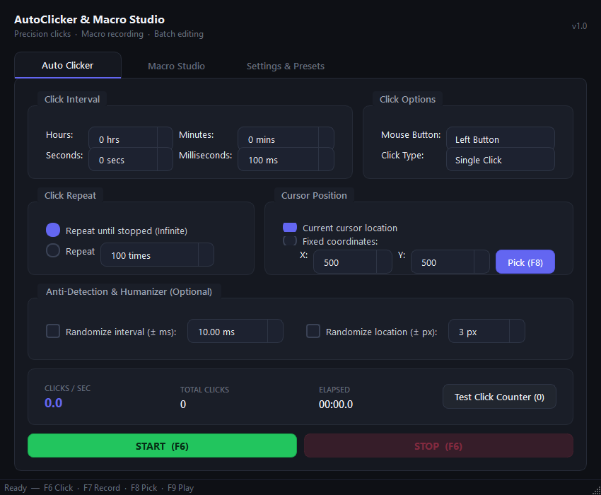
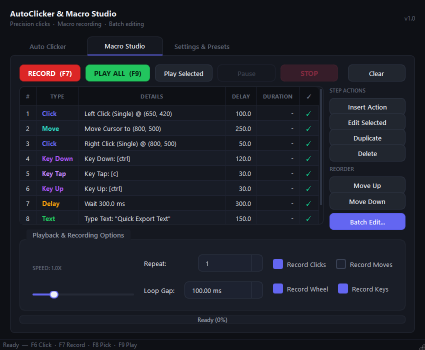
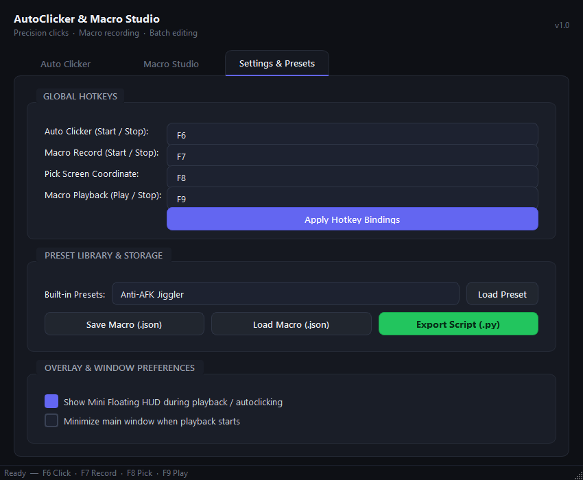

# AutoClicker & Macro Studio

A modern, high-precision Windows desktop application combining a high-speed **Auto Clicker** with a full-featured **Macro Studio** to record, inspect, edit, and replay mouse and keyboard automation sequences.

---

## Screenshots

### 1. Auto Clicker


### 2. Macro Studio (Record, Select, Edit & Playback)


### 3. Settings & Presets


---

## Quick Start

### Running the App
1. **Clone the repository:**
   ```powershell
   git clone https://github.com/yxpao/auto-clicker.git
   cd auto-clicker
   ```

2. **Install dependencies:**
   ```powershell
   pip install -r requirements.txt
   ```

3. **Launch the application:**
   ```powershell
   python main.py
   ```

---

## Global Hotkeys

The application registers global system-wide hotkeys that work even when the window is minimized:

| Hotkey | Action |
|---|---|
| **`F6`** | Start / Stop Auto Clicker |
| **`F7`** | Start / Stop Macro Recording |
| **`F8`** | Open Screen Coordinate Picker |
| **`F9`** | Start / Stop Macro Playback |

*(Hotkeys can be customized anytime in the **Settings & Presets** tab)*

---

## How to Use

### 1. Classic Auto Clicker
1. **Set Click Interval**: Enter hours, minutes, seconds, or milliseconds (supports down to 1 ms).
2. **Choose Mouse Button & Type**: Select Left, Right, or Middle button, and choose Single, Double, or Hold mode.
3. **Select Target Location**:
   - Keep on *Current cursor location*, or
   - Choose *Fixed coordinate* and click **Pick (F8)** to pinpoint any location on your screen with the interactive crosshair overlay.
4. **Start Clicking**: Press **`F6`** or click **START**. The real-time CPS counter and elapsed timer will begin tracking your clicks.

### 2. Recording a Macro
1. Open the **Macro Studio** tab.
2. Press **`F7`** or click **RECORD**.
3. Perform your actions (clicks, mouse movements, scrolls, keystrokes).
4. Press **`F7`** again or click **STOP RECORD**. All steps will be listed in the action table with exact timestamps.

### 3. Selecting & Editing Steps
- **Edit an Action**: Double-click any row (or select it and click **Edit Selected**) to adjust coordinates, key codes, or delay values.
- **Reorder Actions**: Select a row and use **Move Up** / **Move Down**.
- **Insert Custom Steps**: Click **Insert Action** to manually add mouse clicks, movements, delays, keystrokes, or text typing.
- **Batch Edit**: Click **Batch Edit...** to scale playback speed (e.g., 2x faster), shift coordinates by an $(X, Y)$ offset, normalize delays, or add humanized timing jitter.

### 4. Playing Back Sequences
- Click **PLAY ALL (F9)** to run the entire sequence.
- Select specific rows and click **Play Selected** to test a subset of actions.
- Adjust the **Speed** slider or configure **Repeat** loops as needed.

---

## Building a Standalone `.exe`

To package the entire program into a single standalone Windows executable (which runs without Python installed):

```powershell
python build_exe.py
```

The resulting executable will be created in:
```
dist/AutoClickerStudio.exe
```

---

## Project Structure

```
auto-clicker/
├── main.py                     # Application entry point
├── build_exe.py                # Standalone .exe compiler script
├── requirements.txt            # Python dependencies
├── pytest.ini                  # Pytest configuration
├── assets/                     # Application screenshots
│   ├── autoclicker.png
│   ├── macro_studio.png
│   └── settings.png
├── src/
│   ├── core/                   # Engine & logic
│   │   ├── models.py           # Data models (Action, MacroSequence)
│   │   ├── input_sender.py     # Win32 SendInput hardware injector
│   │   ├── autoclicker.py      # High-speed auto clicker engine
│   │   ├── recorder.py         # Global event recorder
│   │   ├── player.py           # Precision playback engine
│   │   ├── hotkey_manager.py   # Global system-wide hotkeys
│   │   └── storage.py          # JSON profiles & script exporter
│   └── ui/                     # PyQt6 user interface
│       ├── styles.py           # Modern dark theme styles
│       ├── main_window.py      # Main window & tabs coordinator
│       ├── autoclicker_tab.py  # Auto clicker controls tab
│       ├── macro_studio_tab.py # Macro studio & table editor tab
│       ├── settings_tab.py     # Settings & preset loader tab
│       ├── action_dialog.py    # Single action editor modal
│       ├── batch_edit_dialog.py# Batch transformation dialog
│       ├── coordinate_picker.py# Interactive full-screen crosshair overlay
│       └── floating_hud.py     # Draggable on-screen status HUD
└── tests/                      # Automated test suite
    ├── test_core.py
    ├── test_engine.py
    └── test_ui.py
```

---

## License

This project is licensed under the MIT License.